# 🔐 Cybersecurity — Password Cracking with Dictionaries & Wordlists

### Week 3 Practical Project | Networkwalks Cybersecurity Internship

---

## 📌 Project Overview

This week's practical focused on understanding password cracking using hashes, password dictionaries, and wordlists.

The task involved recovering the passwords of **three protected PDF files** provided for the Networkwalks internship lab.

I explored two approaches during the exercise: **John the Ripper (JTR)/Johnny** and the password-cracking tools provided by Networkwalks.

This was my **first hands-on experience with password cracking**, and it also became a practical lesson in troubleshooting, choosing appropriate wordlists, and adapting when an initial approach did not work.

---

## 🎯 Objectives

* Understand the basic process of password cracking.
* Extract password hashes from protected PDF files.
* Use password-cracking tools to test password candidates against hashes.
* Understand the role of dictionaries and wordlists.
* Gain practical experience with John the Ripper/Johnny.
* Troubleshoot issues encountered during the practical.
* Successfully recover the passwords for all three authorized PDF files.
* Document the process and results for my cybersecurity portfolio.

---

## 🛠️ Tools & Resources

| Tool / Resource                   | Purpose                                             |
| --------------------------------- | --------------------------------------------------- |
| Networkwalks Hash Calculator      | Extract the hash from the protected PDF             |
| Networkwalks Password Cracker     | Test password candidates against the extracted hash |
| John the Ripper (JTR)             | Password-cracking tool explored during the lab      |
| Johnny                            | Graphical interface for John the Ripper             |
| Password dictionaries / wordlists | Provide password candidates for testing             |
| Windows Laptop                    | Lab environment                                     |

---

## 🔄 Password Cracking Workflow

The practical followed this general workflow:

```text
Protected PDF
      ↓
Hash Calculator
      ↓
PDF Hash ($pdf$...)
      ↓
Password Dictionary / Wordlist
      ↓
Password Cracker
      ↓
Recovered Password
```

---

# 🔎 Part 1 — Extracting the PDF Hash

The first stage was to obtain the password hash from each protected PDF.

The protected PDF files were provided as part of the Networkwalks internship exercise.

I used the **Networkwalks Hash Calculator** to process the files and obtain their corresponding PDF hashes, which began with `$pdf$`.

The complete hash was then used as the input for the password-cracking stage.

### Evidence

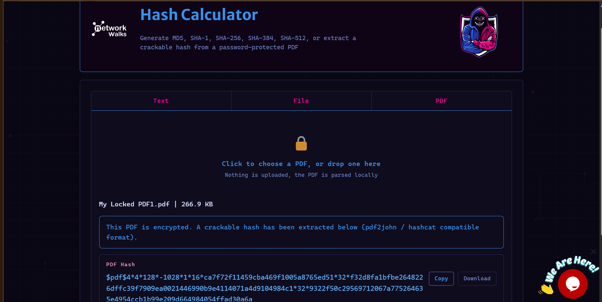
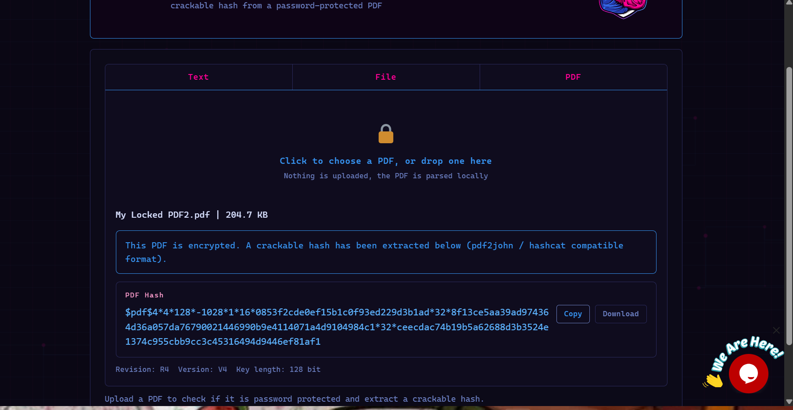
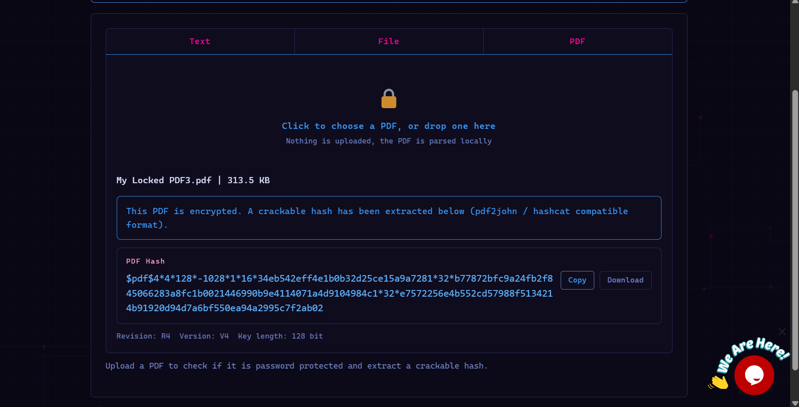

---

# 💻 Part 2 — Attempting John the Ripper / Johnny

I initially decided to try **John the Ripper/Johnny** before moving to the Networkwalks web-based Password Cracker.

After downloading and setting up the software, I encountered issues with the directory and path configuration.

The folder structure on my laptop was different from the path shown in the internship guidelines, so I initially had difficulty determining the correct configuration.

I later changed the directory configuration to point directly to the program files. This caused unexpected behavior, with Johnny repeatedly opening new instances whenever I attempted to launch or reload it.

Eventually, the repeated launches became difficult to control, so I had to shut down my laptop.

When I later tried the hash-text workflow again, starting the attack caused another Johnny instance to open.

Rather than continue with a configuration I was no longer confident in, I decided to switch to the **Networkwalks-provided tools**.

### Evidence

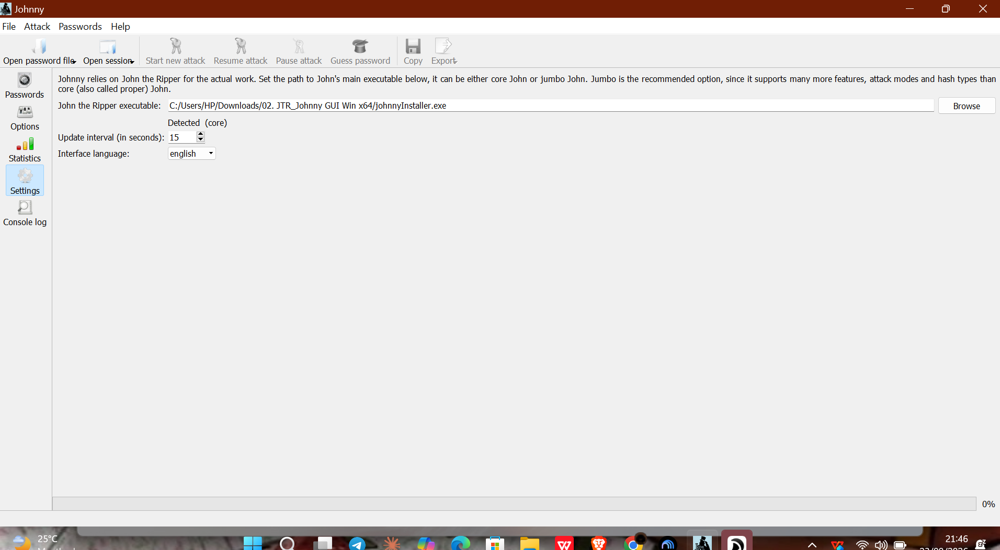

---

# 🌐 Part 3 — Using the Networkwalks Password Cracker

I then moved to the password-cracking tools provided by Networkwalks.

My first attempt used the smaller dictionary available through the Networkwalks Password Cracker.

The dictionary contained approximately **100 common words**.

The passwords for the protected PDFs were not recovered using this initial dictionary.

This was an important point in the practical because it showed me that having a password-cracking tool is not enough on its own. The **quality and size of the wordlist** can have a major effect on the outcome.

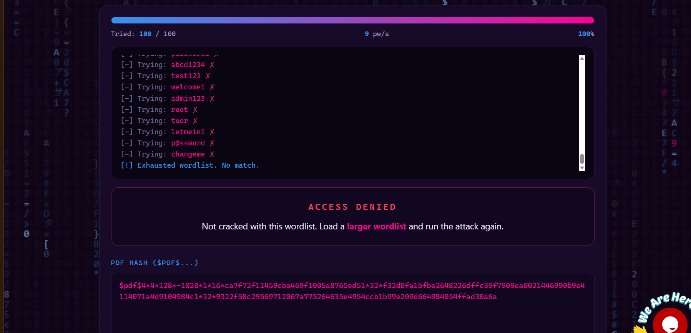
---

# 📚 Part 4 — Finding a Larger Wordlist

After the initial attempt failed, I went back through the resources provided for the internship and looked for larger password wordlists.

I found a larger wordlist associated with **JTR default/common passwords** and used it for the next attempt.

Compared with the initial dictionary, the larger wordlist provided many more password candidates to test.

This ultimately made the difference.

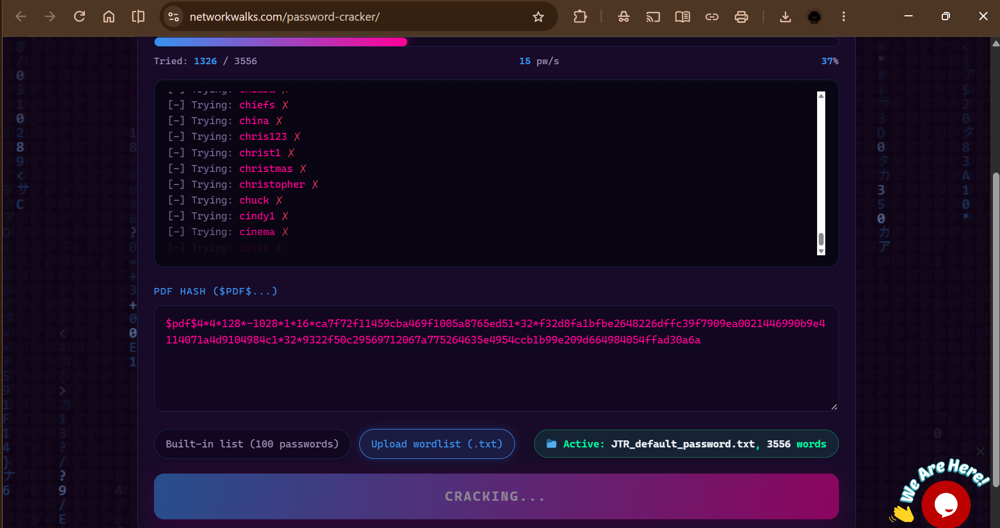
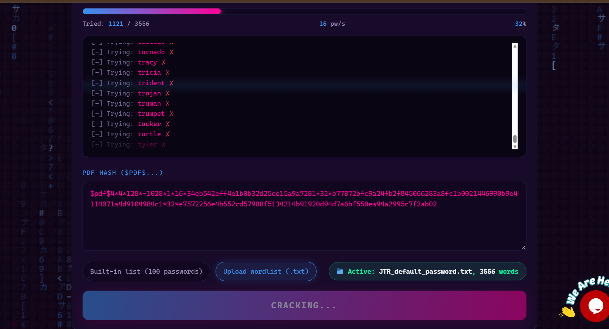

---

# ✅ Part 5 — Password Recovery

Using the larger wordlist, I successfully recovered the passwords for **all three protected PDF files**.

| PDF   | Result               |
| ----- | -------------------- |
| PDF 1 | ✅ Password recovered |
| PDF 2 | ✅ Password recovered |
| PDF 3 | ✅ Password recovered |

### Evidence

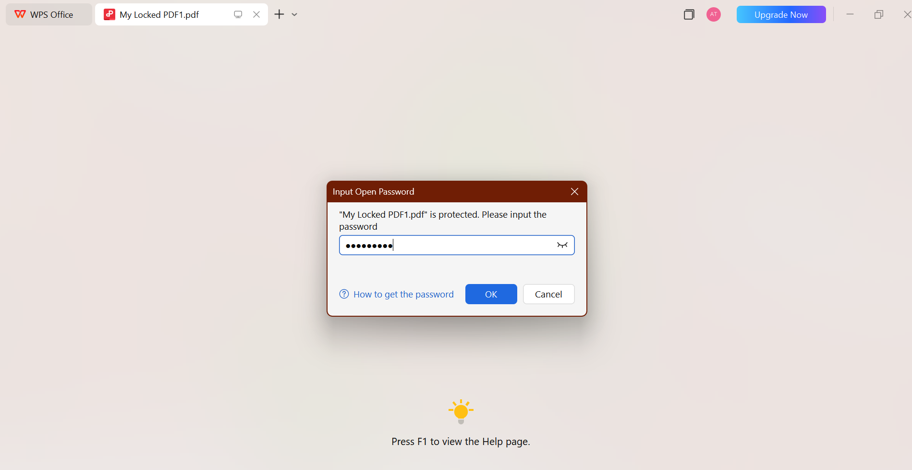

.

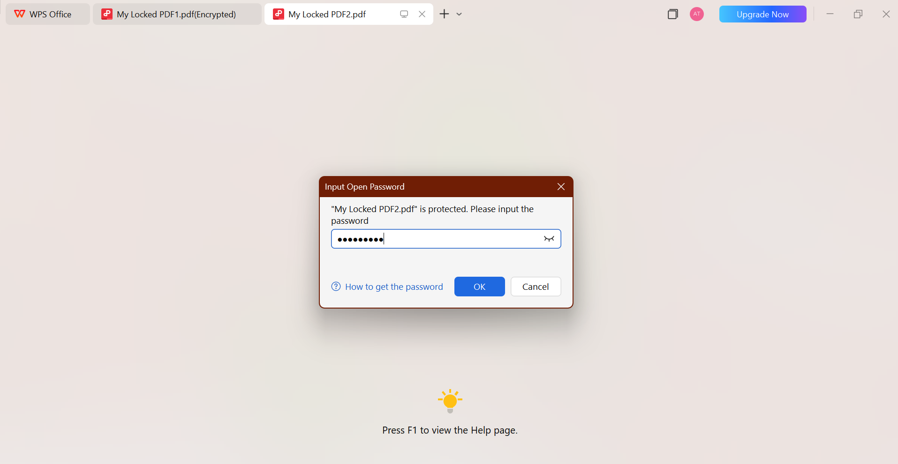

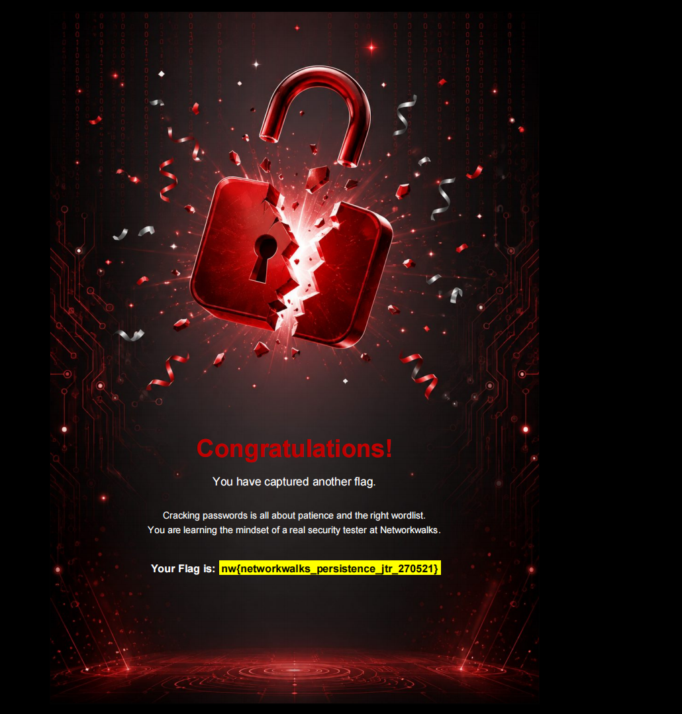

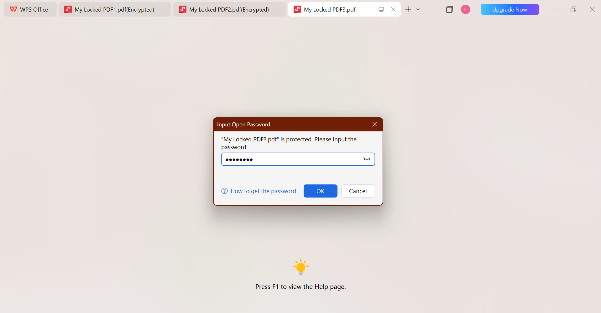


---

# 🛠️ Challenges & Troubleshooting

### 1. John the Ripper / Johnny path configuration

My first challenge was getting the correct directory/path configuration for Johnny because the folder structure on my laptop differed from the example in the internship guidelines.

### 2. Repeated Johnny instances

After changing the path configuration, Johnny repeatedly opened new instances when I attempted to launch or reload it.

This eventually required me to shut down my laptop before continuing with the practical.

### 3. The initial dictionary was too small

The first Networkwalks Password Cracker attempt used a dictionary of approximately 100 common words, but it was not enough to recover the passwords.

### 4. Finding a suitable wordlist

I reviewed the internship resources and found a larger wordlist associated with JTR/common passwords.

Using the larger wordlist allowed me to successfully recover all three passwords.

---

# 🧠 What I Learned

### 🔐 1. Password hashes are different from passwords

A protected file can use a hash representation of its password rather than storing the password in plain text.

The cracking process works by testing password candidates and checking whether they correspond to the target hash.

### 📖 2. Wordlists matter

One of the biggest lessons from this practical was seeing the effect of the wordlist in an actual exercise.

The initial dictionary did not recover the passwords, while the larger wordlist successfully recovered all three.

### 🛠️ 3. Troubleshooting is part of cybersecurity

My first approach with John the Ripper/Johnny did not go as planned.

Instead of continuing with a configuration I could no longer confidently troubleshoot, I reviewed the available resources and moved to another authorized method.

### 💻 4. Practical cybersecurity requires adaptability

The exercise looked straightforward when I first read the instructions, but actually doing it introduced configuration problems and unexpected software behavior.

I learned that practical cybersecurity work is not always about getting the first tool to work. Sometimes, understanding the problem, troubleshooting it, and choosing an appropriate alternative is just as important.

---

# 📸 Evidence

Screenshots from the practical are included in the `screenshots/` directory.

---

# ⚠️ Scope & Authorization

This practical was completed as part of the **Networkwalks Cybersecurity Internship** using files and resources provided for the authorized training exercise.

The password-cracking activities documented in this repository were performed only within the scope of the internship lab.

---

# 📝 Conclusion

Week 3 gave me my **first practical experience with password cracking**.

My initial attempt with John the Ripper/Johnny came with configuration and application issues, but switching approaches and working with a larger wordlist eventually allowed me to successfully recover the passwords for all three protected PDFs.

More importantly, the exercise helped me understand the relationship between **protected files, hashes, password candidates, dictionaries, and wordlists**.

It also reminded me that cybersecurity is not always about getting everything right on the first try. Troubleshooting, researching, adapting, and documenting what went wrong are all part of the learning process.

---

## 👩🏽‍💻 Author

**Tijani Ayomide**

Cybersecurity Intern — Networkwalks
**Batch B083**

